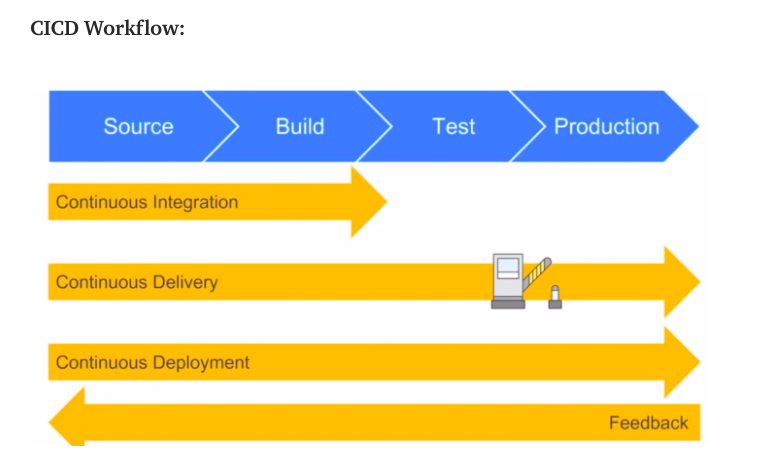

# So what does DevOps actually mean?
-       DevOps is an amazing software development methodology that combines software development (Dev) with IT operations (Ops) participating together in the entire service life-cycle, from design through the development process to production, it is a set of practices that automate the processes between software development and IT teams, in order that they can build, test, and release software faster.   
-       In a nutshell — DevOps is a culture that bridges the gap between development and operation teams
## Continuous Integration (CI)
-       Developers merge/commit code to master branch multiple times a day, fully automated build and test process which gives feedback within few minutes, by doing so, you avoid the integration hell that usually happens when people wait for release day to merge their changes into the release branch.
## Continuous Delivery:
-       Continuous Delivery is an extension of continuous integration to make sure that you can release new changes to your customers quickly in a sustainable way. This means that on top of having automated your testing, you also have automated your release process and you can deploy your application at any point of time by clicking on a button. In continuous Delivery the deployment is completed manually.
## Continuous Deployment
-       Continuous Deployment goes one step further than continuous delivery, with this practice, every change that passes all stages of your production pipeline is released to your customers, there is no human intervention, and only a failed test will prevent a new change to be deployed to production.

## difference between contiuous deivery and countinues seployment:
-       To put it simply, the continuous integration is part of both continuous delivery and continuous deployment. The main difference is the deployment step, in continuous delivery the deployment is done manually and in continuous deployment it happens automatically.
